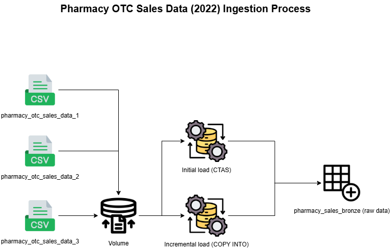

# Pharmacy OTC Sales Data (2022)

This dataset presents simulated transactional data for over-the-counter (OTC) pharmacy product sales across several countries from January to August 2022.
Each record includes the sale date, product name, salesperson involved, units shipped, transaction amount, and country of sale.

## Ingestion process

